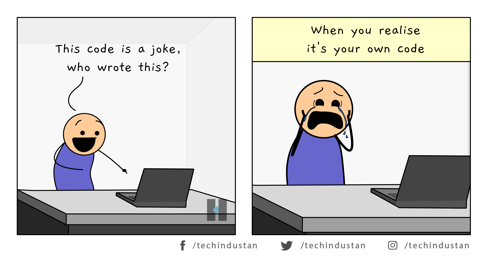

Want to improve the quality of your code and become a better programmer? Great! Following and fixing your program to match coding standards is a great place to start! But wait…what are coding standards and how are they helpful? 

## What are Coding Standards? 

Coding standards are defined as a set of guidelines and practices that are used to create consistent, high-quality code. In other words, these guidelines and practices are designed to neatly organize code in a way that’s readable for yourself, others who may look at your code, and the compiler, a special program that translates source code like JavaScript into machine code. Similar to a how-to article, the syntax of a programming language helps coders break down a program or large chunks of code and visually see what needs to happen step-by-step to obtain a specific outcome. 

A particularly helpful coding standard is leaving comments throughout my program. Leaving comments helps my future self understand what a function or line of code does when coming back to the program after some time. Leaving comments that describe the purpose of each line of code within a complex function also helps me understand what is going on in the function and figure out why my code may not be working when debugging my program. 

## A New Helper 

When coding in JavaScript, a program that helps ensure your code follows coding standards is a tool called ESLint, which I recently started using with IntelliJ. ESLint is extremely helpful by identifying syntax errors within JavaScript code that may hinder the execution of a program and providing feedback on how to neatly organize a program’s code. For example, ESLint lets me know if I have an unused variable or function within my program. This feature can be helpful when debugging large programs, as it highlights unnecessary variables or lines of code. Furthermore, this reminds me to spell-check variable names or test out the function if it’s not used anywhere else in the program.

## Work Smarter, not Harder 

While using ESLint, if your program follows coding standards, a green check mark appears at the top right corner of the code editor. However, if a program has syntax errors, ESLint highlights said errors with a red squiggly line and a yellow or red caution symbol depending on the severity of the issue, which is useful but a little annoying at times. 

On one hand, if my code has severe syntax errors, the red caution symbol is accompanied by a “fix current file” feature that corrects my errors all at once, which saves time since I don’t have to look through my code and fix each minor error manually. Receiving a green checkmark also tells me that my code follows coding standards and that there aren’t any syntax errors that could hinder my program from running. On the other hand, the syntax error feature can be a little annoying when it highlights minor syntax problems as severe errors. If I forget to put a space between a function’s parameter(s) and the following bracket, a red caution symbol pops up next to the line of code. Although minute details like putting a space between a function’s parameter(s) and bracket are advised, I don’t think this should be seen as a severe error warning. These minute syntax differences are more of a preference and don't affect my ability to execute code. As long as my code runs successfully, I receive the correct output, and the major coding syntax rules are followed, I don’t think these minute differences should be classified as a severe error, though it could instead be flagged as a weak warning. 
