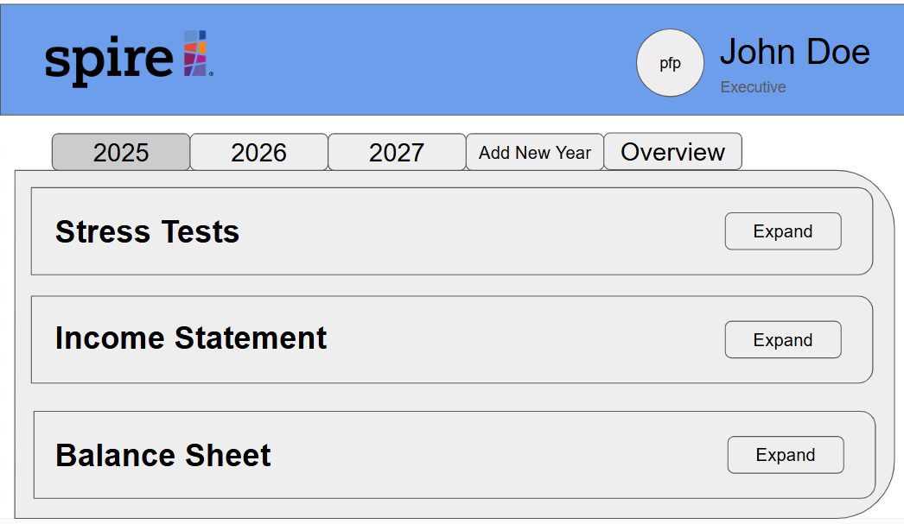
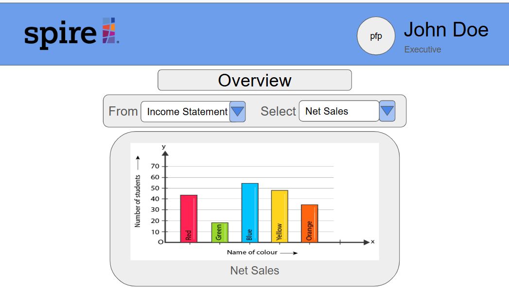

  <li><strong>Role: </strong>Full-Stack Developer of Executive Page (Team of 5)</li>
  <li><strong>Duration: </strong>1 semester/16 weeks</li>
  <li><strong>Tools: </strong>GitHub, Next.js, Meteor </li>
  <li><strong>Responsibilities: </strong>Created Executive Landing and Overview pages. </li>
 

## Overview 
Aspire-25 was a team-based project that aimed to develop a web application for Spire Hawaii, a Honolulu-based CPA firm. Our app transitioned Spire's Fiscal Sustainability Model (FSM) from a complex Excel-based tool into a user-friendly web platform, improving functionality and usability for financial forecasting. 

Depending on one's role in the company, a user can view or edit different types of information. For this project, there will only be four different roles: Auditor, Analyst, Executive, and Admin. 

<strong>Issue:</strong> Financial data is currently being tracked using Excel spreadsheets. Spire Hawaii only wants certain roles to be able to view or edit different types of information. 

<strong>Solution:</strong> Users can edit or view certain types of information based on their role and hiearchy in the company. 

<strong>My Role:</strong> Create an executive's landing and financial overview page. 

 
## Inital Landing and Overview Pages
Executives can view summaries of financial data, including overall performance metrics and key financial insights. They do not have data input access, as data entry is reserved for auditors.

### Landing Page 
Executives can quickly review financial stress tests, income statements, and balance sheets filtered by year for high-level analysis.
 

### Overview Page 
Executives can analyze trends and key metrics across the three main financial categories, focusing on summarized financial performance rather than detailed data entry.

