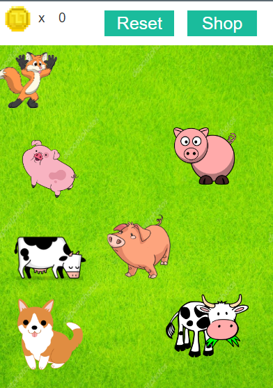
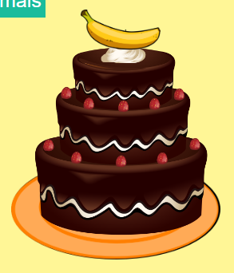

Build-A-Cake is a simple game I developed for Intro to Programming, an intro JavaScript class from high school. The game's objective is to collect coins in order to buy ingredients and materials needed to build a cake. The player must capture different animals to earn coins, but watch out! A fox also roams with the animals and if the player taps on the fox, he or she loses half of their coins. If needed, players can capture more animals by hitting the Reset button on the Animal screen in order to earn more coins. 

Play [Build-A-Cake](https://studio.code.org/projects/applab/QzBwCoVjdjdl3HWMweaKXc3xjkXXtjBETa3IAzCxf2I). 
