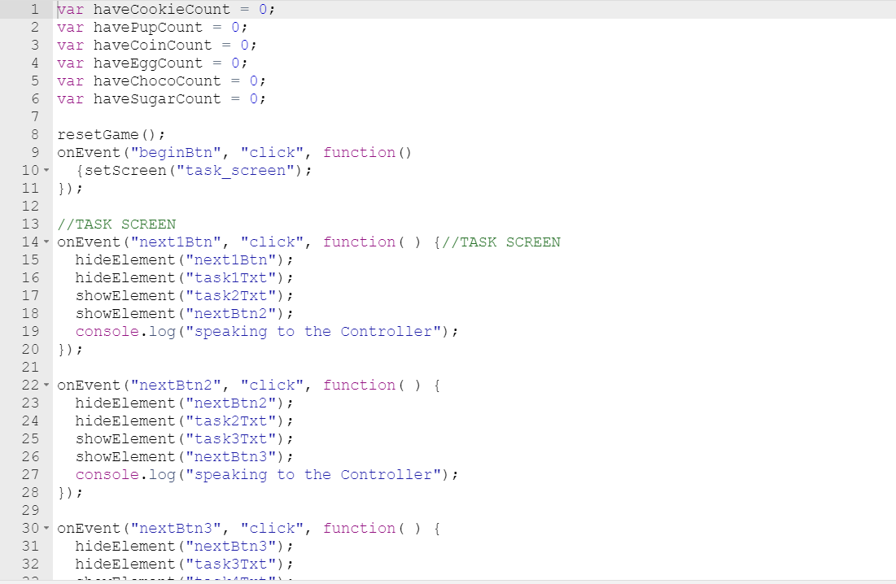

  
  

Escape the Dimensions is a puzzle-style adventure mobile game I developed for my final project for Intro to Programming, a class from high school. In the game, an evil character called the Controller has sucked the player into a black hole and has thrown the player off course as they travel home from visiting another planet. In order to leave the black hole, the player must collect a series of items the Controller requests. To collect said items, the player must perform a series of tasks in three different dimensions. 

For this project, I implemented dropdown menus, buttons, and console log statements. Console log statements were used to record the player's choices. Buttons were used throughout the game to travel between the different dimensions and obtain items. Dropdown menus were used for a various parts of the game such as a passocde screen and agreement form. Players cannot move onto the final stage of the game until he or she completes all tasks and obtains all items needed. 

If you would like, you can play the game here [Escape the Dimensions](https://studio.code.org/projects/applab/kfxRYqG93fIC2xD0DqVCAbT63u_I6bnxRB2vCoqUHBY).
