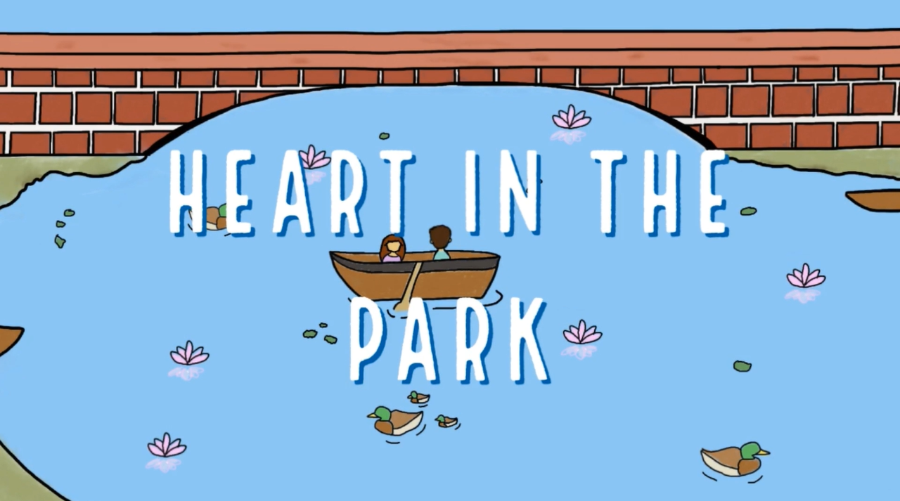
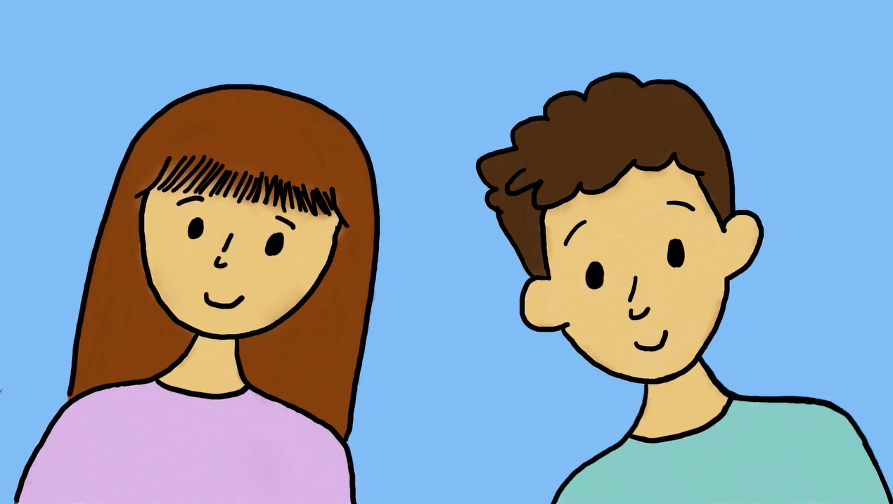

  
  
  

In my Intro to Filmmaking class, one of our assignments was to write a screenplay. As a class, we collectively chose two screenplays to produce. My screenplay, "Irreversible", was one of two screenplays chosen to be produced by the class. During production, my roles were writer and co-director. Here is a pitch for the film: 

After receiving a pass to the new time machine attraction at her local fair, Lina travels back to the year 1940, where she unknowingly bumps into her grandfather, preventing her grandparents from meeting. Nothing’s ever the same when Lina later realizes her mistake after traveling back to the future, and she must now live in her new, altered world. 

In my Advanced Filmmaking class, another screenplay I wrote called "Noitalumis" was chosen to be produced by the class. However, due to the pandemic, the project was left unfinished and we were tasked with producing short films on our own. For my final project, I created a short animation called "Heart in the Park". 

Watch [Heart in the Park](https://drive.google.com/file/d/1h3aIV6LaPFNxmV16-ipIA2YnXnZbj1-_/view?usp=sharing) or learn more at [HBA Arts & Film Festival](https://hbaaff.hba.net/about-hbaaff).
