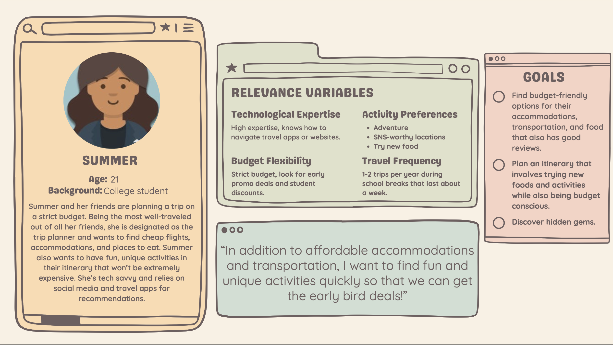
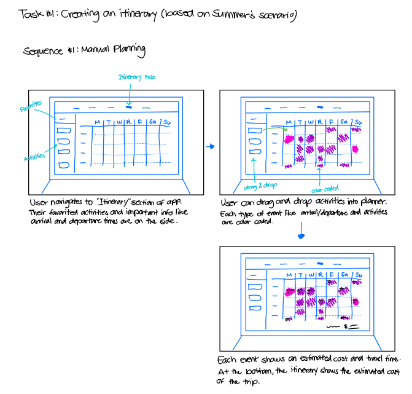
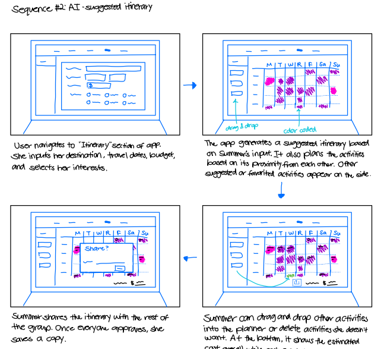
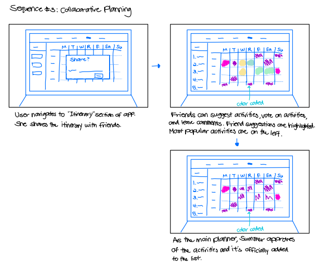
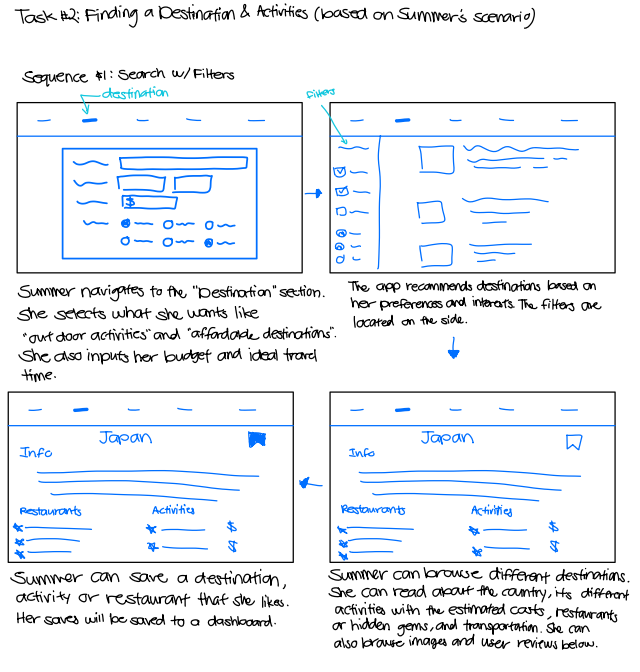
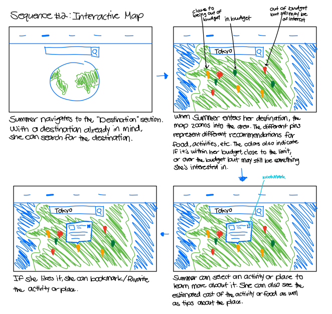
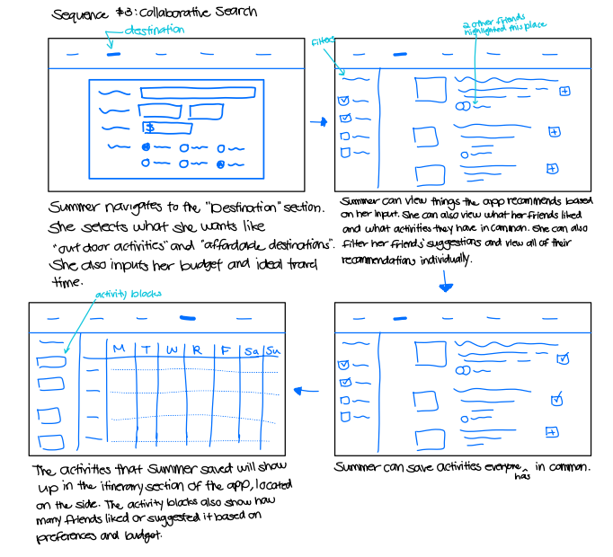

<li><strong>Role: </strong>UX/UI Designer (Team of 3)</li>
<li><strong>Duration: </strong>1 semester/16 weeks</li>
<li><strong>Tools: </strong>Figma, Notability, Google Docs </li>
<li><strong>Responsibilities: </strong>Pitched multifunctional travel planning app, conducted user interviews, designed wireframes and high-fidelity mockups, developed home and itinerary pages. </li>
 

## Overview 

ItinerEase is a mobile app built to help travelers plan and organize every aspect of their journey easily and confidently. Based on interviews with fellow classmates on their traveling experiences, our team identified several difficulties with travel planning such as organizing trip details, managing budgets, finding trustworthy recommendation, discovering authentic local experiences, and navigating unfamiliar locations. In order to solve these problems, IntinerEase offered four key features: budgeting tools, itinerary planning, destination exploration, and favorites lists. 

I proposed the idea for ItinerEase based on my passion for travel and the desire for a single platform that simplifies the entire planning process. As part of the design team, I conducted user research and designed the wireframes and high-fidelity mockups for the home and itinerary pages.

## Research 

### Persona 
Each team member created a persona of a potential user. I created the persona Summer, a young college student looking to travel with friends. 
  

### Scenario 
  I created the following scenario for the continuation of the persona of Summer. 

​<strong>​Summer Plans a Budget-Friendly Adventure</strong>

Summer and her friends want to visit Japan during their spring break. Since Summer is the most experienced traveler in the group, she’s responsible for planning their itinerary while sticking to a strict budget. While browsing the travel planning app, she filters her search for discounted flights. After booking their flights through the airline’s website, she comes back to the travel planning app and searches for cheap hotels or AirBnBs with good reviews. After figuring out their accommodations, Summer uses the itinerary section of the app to discover budget-friendly, hidden gem restaurants and cafes with great reviews. Furthermore, she also researches clothing stores with great deals and prices such as thrift shops or underground malls. She saves spots that she thinks the rest of the group will love and shares the itinerary with everyone else. The itinerary showcases the estimated cost of each activity, the approximate total for the trip, and how long each activity may take. Once she receives feedback from her friends, she can easily rearrange certain activities or take it out altogether. Additionally, she can plan out the order in which the group will do activities by looking at the map section and determining each location’s distance from each other as well as how to get there based on bus or subway routes. The travel planner suggests apps that may have more detailed information about Japan’s transportation systems and also offers an offline map that highlights bus and subway routes in case the internet connection is bad.

### Core Features and Functionalities 

1. Personalization and Recommendations 
* Users can create profiles and input preferences (e.g., budget, interests, travel style).
* AI-driven recommendations based on user preferences, location, and real-time events.
* Offline access to saved recommendations and guides.

2. Itinerary Planning and Coordination 
* Users can manually create or auto-generate itineraries based on location and interests.
* Estimated travel duration between destinations displayed in the itinerary.
* Collaborative itinerary feature allows friends to contribute to trip planning.
* Export or share itinerary with contacts for safety purposes.

3. Transportation and Maps 
* Public transit options with estimated costs and schedules.
* Suggested third-party transit apps for detailed route planning.
* Offline maps with preloaded routes for navigation without internet access.

## Wire Frames 

### Task 1: Creating an Itinerary 
<strong>Sequence 1:</strong> A user wants to manually plan her trip itinerary by hand. 

<strong>Sequence 2:</strong> A user isn’t sure where to start with planning her trip, so she inputs her travel details and interests into a form. Based on her input, an AI tool generates a base template itinerary. She can keep the itinerary as is or make edits. 

<strong>Sequence 3:</strong> A user is going on a trip with other people. Although she’s the main organizer, she wants to gather feedback from her travel companions on what everyone wants to do and when. 

### Task 2: Finding a Destination and Activities 
<strong>Sequence 1:</strong> The user isn’t sure where to travel for her next trip. She inputs her preferences and the app provides recommendations for destinations and activities based on her interest and travel style. 

<strong>Sequence 2:</strong> With an interactive map, the user can explore various activities or destinations based on location. 

<strong>Sequence 3:</strong> Similar to Sequence 1, the user enters her travel details and interests, leading the app to generate activity suggestions. Since she'll be traveling with others, she can also see which activities her companions are interested in and their priority levels for each activity. 

## Home Page
 The home page provides users with an overview of their upcoming trip, including a countdown, upcoming activities based on the itinerary, and quick access to saved destinations.
 

    
<strong>Issue: </strong>Travelers often need to visit different pages to find trip information.

    
<strong>Goal: </strong>Provide travelers with a brief overview of their upcoming trip.

    
<strong>Design Solution: </strong>Provide travelers with a brief overview of their upcoming trip, helping users quickly access key information before and during the trip.

    
<strong>Key Elements:</strong>

    <ul>
      <li>Countdown timer to build anticipation and track departure</li> 
      <li>Daily itinerary highlight for quick reference</li>
      <li>Saved destinations for trip inspiration and access</li>
    </ul>
  

  

## Itinerary

The itinerary page allows users to view and manage their daily schedule, budget, and estimated trip costs in one place.

  
<strong>Issue:</strong> Travelers need a centralized way to manage schedules, budgets, and trip costs.

  
<strong>Goal:</strong> Provide an organized view of daily plans and overall trip expenses.

  
<strong>Design Solution:</strong> Create an itinerary calendar where users can view their daily schedule, track spending, and manage trip activities efficiently.

  
<strong>Key Elements:</strong>

  <ul>
    <li>Daily itinerary view with scheduled activities</li>
    <li>Budget tracker and estimated trip cost breakdown</li>
    <li>Add and remove events from itinerary calendar</li>
  </ul>

  

## Future Expansions 
Future versions of ItinerEase could expand the user's travel planning experience by incorporating these features: 
* Integrated booking for flights and accomodations 
* Live and offline maps for navigation 
* Expanded cultural etiquette tips 
* Optional AI-generated itinerary templates for travelers seeking planning assistance 

View the [ItinerEase Prototype](https://www.figma.com/proto/9UGj3FXVvC7bISWQTZCKkZ/ItinerEase?node-id=71-1424&starting-point-node-id=71%3A1424) and the [Project Requirement Document](https://docs.google.com/document/d/19NFUBMDWor48_GyytEXFi6U-8g-63cwMYUC0l2U-bKA/edit?usp=sharing). 
