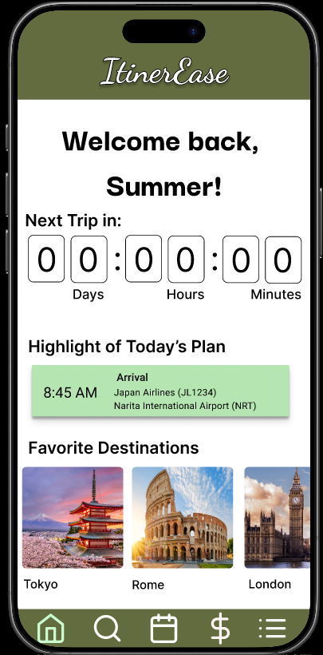
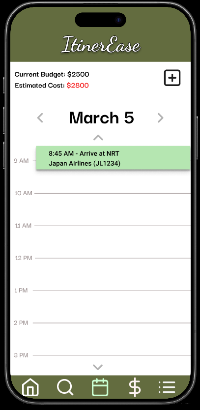
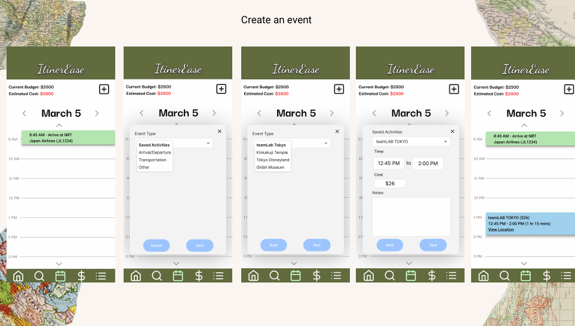
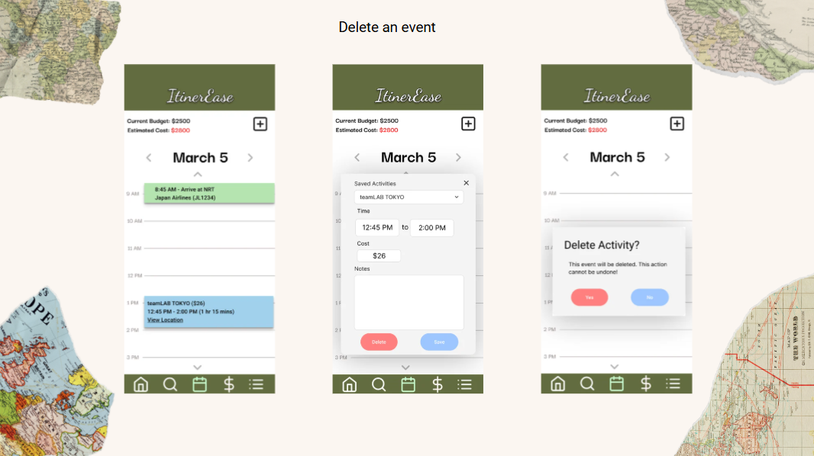

* Role: UX/UI Designer (Team of 3)
* Duration: 1 semester/16 weeks 
* Tools: Figma, Notability, Google Docs 
* Responsibilities: Pitched multifunctional travel planning app, conducted user interviews, designed wireframes and high-fidelity mockups, developed home and itinerary pages. 

## Overview 

ItinerEase is a mobile app built to help travelers plan and organize every aspect of their journey easily and confidently. Based on interviews with fellow classmates on their traveling experiences, our team identified several difficulties with travel planning such as organizing trip details, managing budgets, finding trustworthy recommendation, discovering authentic local experiences, and navigating unfamiliar locations. 

In order to solve these problems, IntinerEase offered four key features: budgeting tools, itinerary planning, destination exploration, and favorites lists. 

I proposed the idea for ItinerEase based on my passion for travel and the desire for a single platform that simplifies the entire planning process. As part of the design team, I conducted user research and designed the wireframes and high-fidelity mockups for the home and itinerary pages.

## Home Page
The home page provides users with an overview of their upcoming trip, including a countdown, upcoming activities based on the itinerary, and quick access to saved destinations.

  

<li> Goal: Provide travelers with a brief overview of their upcoming trip. </li>
<li>Key Elements: Trip countdown, upcoming activities, and saved destinations. </li>

 
 
 
 

## Itinerary 
By selecting the calendar app from the bottom menu, users will see their daily itinerary, current budget, and estimated cost of the trip based on flights, accomodations, and activities. 

  

Users can add an event to their itinerary by clicking the plus button then selecting the event type. Based on the event type selected, users can narrow down the event category. In the example, the user selected "Saved Activities", leading to a list of saved or booked activities. The user input the estimated time frame, cost, and has the option to add notes. Once saved, the new event appears in the daily intinerary. 

Users can also delete an event from their itinerary calendar by tapping the event and hitting delete, confirming their action. 

## Future Expansions 
Future versions of ItinerEase could expand the user's travel planning experience by incorporating these features: 
* Integrated booking for flights and accomodations 
* Live and offline maps for navigation 
* Expanded cultural etiquette tips 
* Optional AI-generated itinerary templates for travelers seeking planning assistance 

With more time alloted, we wanted to display recent searches and suggestions, give users the ability to book their travel and lodging accomodations, expand cultural ettiquette tips, have the option to create an AI-generated itinerary template that could be used as a base if travelers are unsure of where to start in their planning phase, and include a live and offline map function that would allow users to view their travel route live and offline. 

View the [Figma Live Demo](https://www.figma.com/proto/9UGj3FXVvC7bISWQTZCKkZ/ItinerEase?node-id=71-1424&starting-point-node-id=71%3A1424) and the [Project Requirement Document](https://docs.google.com/document/d/19NFUBMDWor48_GyytEXFi6U-8g-63cwMYUC0l2U-bKA/edit?usp=sharing). 
