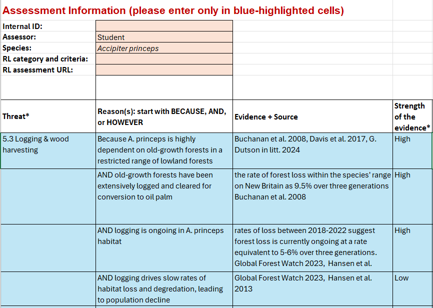
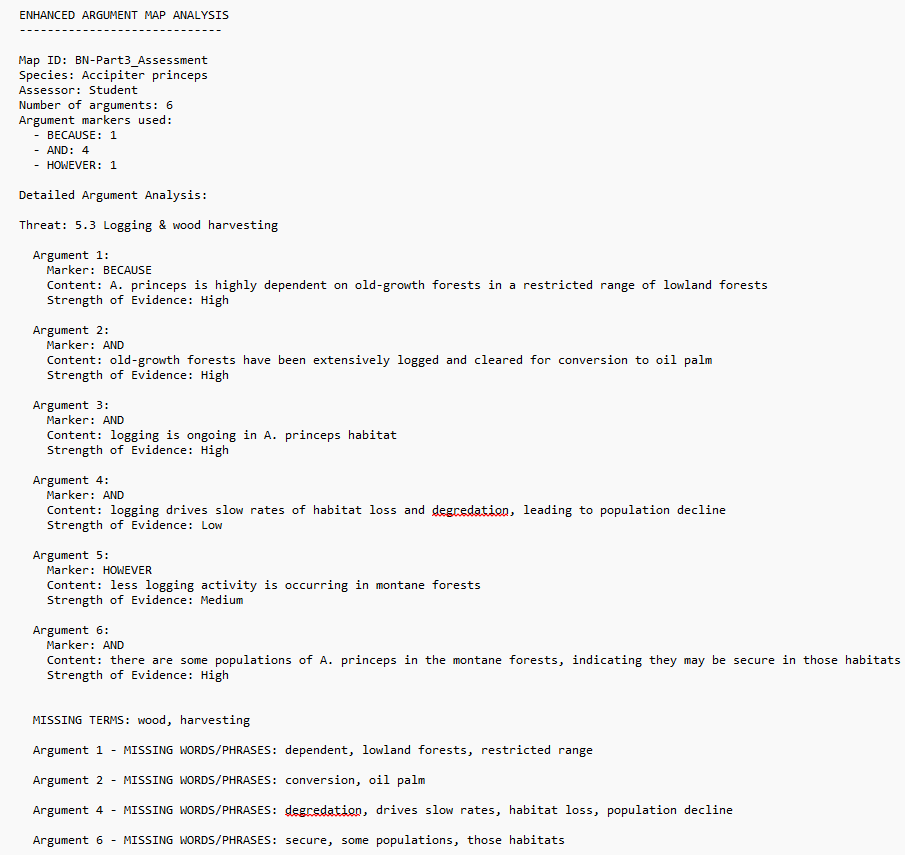

<li><strong>Role: </strong>Software Developer/Point of Contact (Team of 2)</li>
<li><strong>Duration: </strong>1 semester/16 weeks</li>
<li><strong>Tools: </strong>Github</li>
<li><strong>Responsibilities: </strong>Became point of contact for our faculty sponsor and helped develop program requested by faculty member. </li>
 

## Overview
Twenty graduate students in the School of Life Sciences (SoLS) at UH Manoa evaluated threat assessments for endangered species listed in the IUCN Red List and represented these assessments as argument maps in the form of Excel spreadsheets. The project involved creating a program that would read the spreadsheets and measure the quality of the argument maps. Built with tkinter, pandas, and nltk, the IUCN Spreadsheet Analyzer is a Python-based GUI tool that evaluates the quality of the argument maps by processing data, identifying argument structures, and outputs reports. 

## Argument Maps 
Dr. Mark Burgman, Director at UH Manoa's School of Life Sciences and our faculty sponsor for the project, provided example argument maps created by graduate students. The important aspects of each map were the threat, reasonsm evidence, and strength of the evidence fields. Ensuring the assessment followed a consistent format was crucial, allowing the GUI to parse the contents accurately or flag problematic files. 

## Results 
The IUCN Spreadsheet Analyzer displays key information extracted from the Excel files such as the file name, assessed species, assessor’s name, the number of reasons provided, and the number of markers for reasons, rejections, or rebuttals. The analyzer shows a further detailed breakdown of the primary threat, reasonings, and the strength of the evidence. At the end of each analysis, the analyzer identifies missing terms from the claim within the reasons, and flags terms or phrases that appear only once across the argument map, indicating which argument maps need to be fixed. 

View the [Threat Assessment Project Poster](https://drive.google.com/file/d/13DlpmIVkM7QGc3PDkds5MuCWflC6zK-b/view?usp=drive_link) that summarizes the project in a visual format. 
