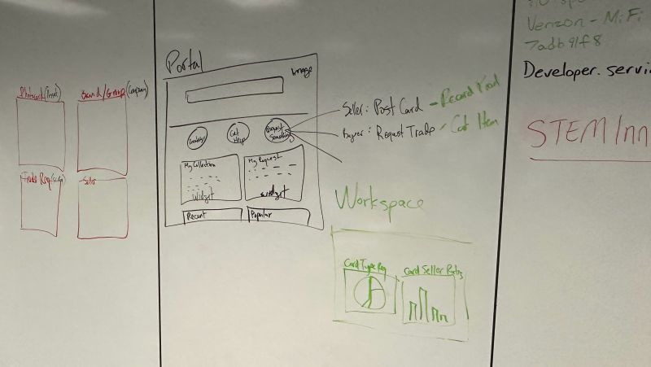
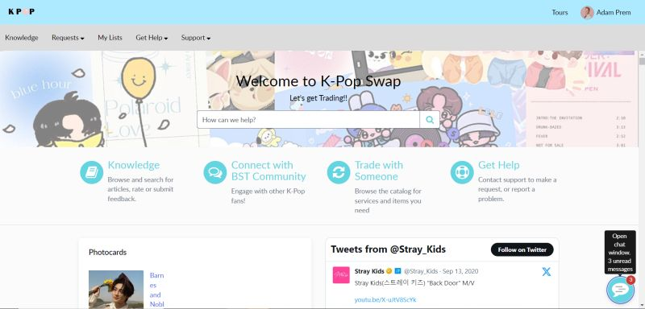

At the beginning of November, I attended the ServiceNow AFCEA Hawaii App Engine Workshop. 

For context, [ServiceNow](https://www.servicenow.com/company.html) is a cloud-based software platform designed to help enterprise companies manage digital workflows. They set up systems that manage, automate, and structure IT services for organizations. 

The Hawaii App Engine Workshop hosted by ServiceNow was a two-day workshop meant for high school and university students to learn more about ServiceNow’s digital platform and their Creator Workflows. ServiceNow’s Creative Workflows consist of tools designed to build apps without code, allowing anyone to become a software developer regardless of IT background or coding knowledge.

On the first day, a mentor from ServiceNow taught us the basics of how to use their platform. However, on the second day, we created an app of our own choice in groups of three to four along with a team leader/mentor who works at ServiceNow. My team created a K-pop trading card app called "K-Pop Swap". 
 
## Context on The World of K-pop 

In the world of K-pop, fans often buy physical albums of the groups they like. Although streaming music has become the norm, fans buy physical albums because each album comes with various inclusions such as postcard images of the group or a member of the group, stickers, posters, and most importantly a photocard(s) of a specific member. However, the photocard inclusion is special because it is random and buyers don’t know who’s photocard they’ll get. Moreover, fans usually have a favorite member, known as a “bias”, and always hope to get the photocard of the member they like. However, fans aren’t always lucky and don’t get their bias’s photocard. As a result, people attempt to trade their photocards online through social media with other fans, similar to trading Pokemon cards. 

Since there is no official platform to trade said type of cards, our group wanted to create an app where traders can safely trade their photocards with other fans. On K-Pop Swap, traders can post what type of photocard they have and are looking for. Fans can also view what photocards are up for trade and can request to trade with another fan. Moreover, while browsing through the photocards, fans can also view tweets from different groups, as the data is pulled from X/Twitter. 

Here is a hand-drawn blueprint of how we planned on creating the app. 

## K-Pop Swap

In my team, I came up with the name “K-Pop Swap” for our app. I also started the workflow we used to create the app. Furthermore, I designed the banner background on the home page, which I also use as my laptop background. Moreover, we had a few images of different photocards posted on the home page. However, the photocard images were horizontally distorted. The names of each respective photocard were meant to appear next to the photocard image; however, the text format was also distorted, as the text would appear next and under the image if the photocard had a long name. To fix the distortions, I resized the photocard images by manually editing the CSS stylesheet, as we were having trouble resizing the images using the Creator Workflows tools. Additionally, I helped populate data in the app by adding images and descriptions of different photocards. The description included information such as what K-pop group the photocard is from, who it is, what album the photocard is from, and the photocard version, as there are multiple photocard versions of the same group member. 

At the end of the workshop, each team presented their project. After the presentations, students would vote via Kahoot on which group’s app was the best. Due to the complexity and aesthetic appeal of our app, our team was voted the best app by our peers. 

## A Learning Experience 

This workshop provided me with hands-on experience in creating an app with little to no coding. As I’m interested in low-code app development, I learned how these types of software work and how it is used in the real world. Furthermore, this was also a great opportunity to meet other students with similar interests or aspirations and learn more about the low-coding world through ServiceNow developers. 

Unfortunately, my team leader hasn't sent the saved project yet, so I don't have a link to it but will post a link to it once I receive it. 
