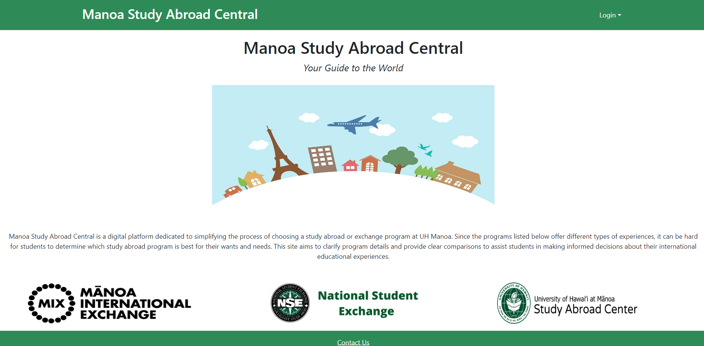
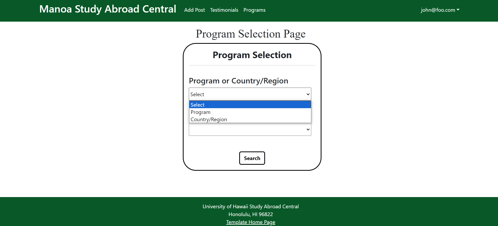
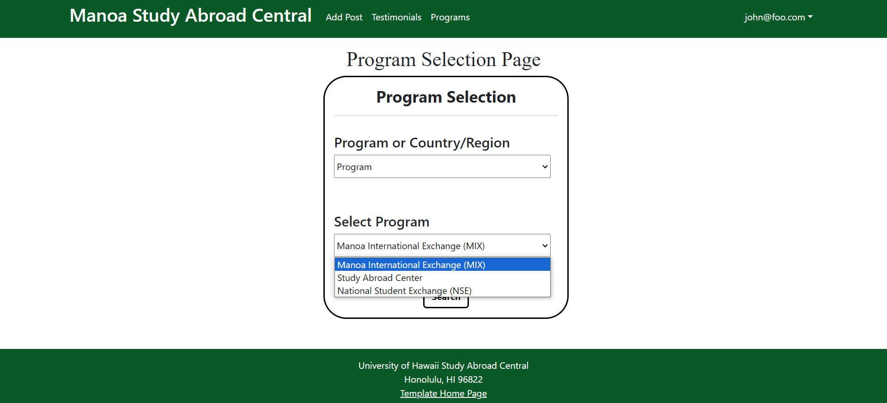
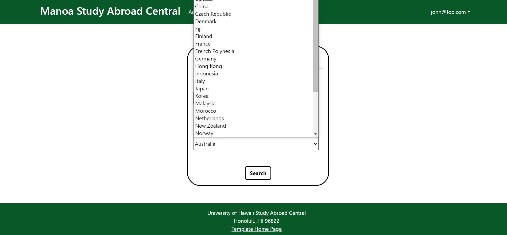
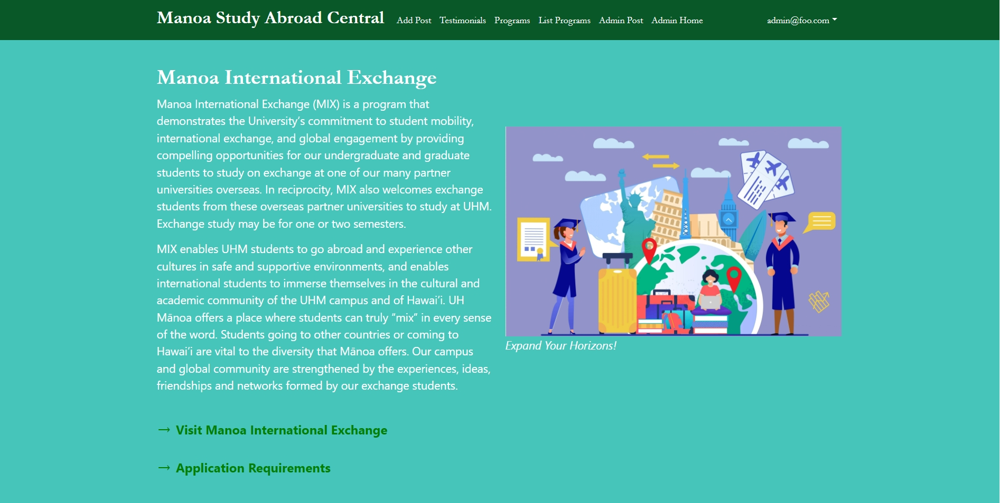
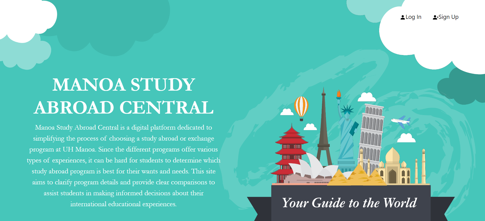
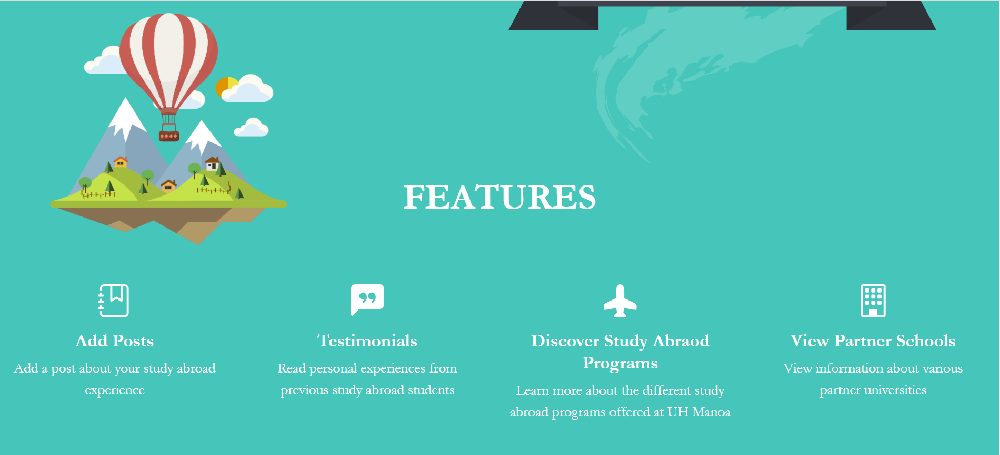
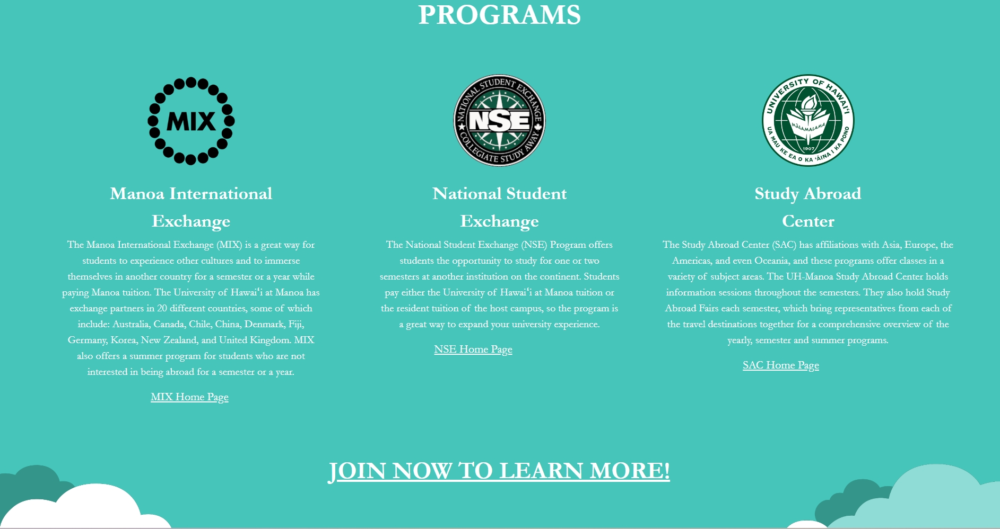
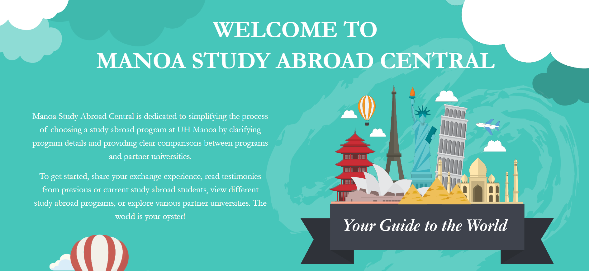
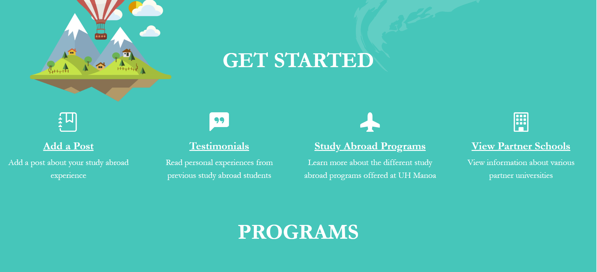

Manoa Study Abroad Central is an application I developed with a few classmates from ICS 314, a software engineering course. The website’s purpose is to help UH Manoa students find more information about the different study abroad programs at our university. Since the different programs offer various types of experiences and partner with numerous schools and regions, Manoa Study Abroad Central helps students figure out which program is best for them. Our platform includes several features such as adding a post about one’s study abroad experience, reading reviews from previous or current study abroad students, information about the three different study abroad programs, and numerous universities partnered with UH. 

In order to finish the project on time before our deadline, my teammates and I split up various tasks for three weeks, each of us having at least two tasks to complete for each respective week. 

# First Week 

For the first week, I started our GitHub organization and ReadMe file. I also created the initial landing page, the first page users view when visiting the website. 

# Second Week 

During the second week, I improved the program selection page of our website. On the program selection page, users can search for information about a country or study abroad program. I updated the page so that users could find information about a program or country based on their preference. 

### Program Search Page
In the first dropdown menu, users could either select “Program” or “Country/Region”. 

If the user selects “Program”, the second dropdown menu populates with the different study abroad programs. After selecting a specific program and hitting “Search”, the application takes the user to the respective program’s informational page, though this feature was not yet implemented until week three by a teammate. 

On the other hand, if the user selects “Program/Region”, the second drop-down menu would instead populate with different countries or regions available to study abroad students from UH Manoa. 

### MIX Page
I also created the informational page for the Manoa International Exchange (MIX) program at UH Manoa. The page gives a brief overview of the program followed by a link to the MIX homepage and application at the bottom of the page. 

# Third Week 

For the final week, I was in charge of improving the design of the landing page and subsequent pages available to users. 

### Updated Landing Page 
I improved the design of the landing page and user pages using a CSS stylesheet and re-doing the layout of the landing page.

### New Home Page
I also created a new homepage that the user is redirected to after logging in to the website, which looks somewhat similar to the landing page and is different from the admin home page. To improve the user pages, I updated the CSS stylesheet so that the pages had continuity where each page would have the same background color, font, font color, and font size. 

# Learning Outcomes

Although I sort of knew how to use BootStrap React beforehand, this project has exponentially helped me learn more about the different features of BootStrap React, giving me hands-on experience. Though I struggled through it, I learned how to create complex web pages. This project has also shown me what it takes to create a well-functioning application and what goes on behind the scenes of websites I use daily. 

Throughout the project, I mostly worked on front-end development and web design, which I enjoyed. As I was sort of interested in web design and front-end development beforehand, this project has furthered my interest in these two areas. In the near future, I hope to do something similar in my future career or internships. 

Additionally, I enjoyed working on this website since I’m interested in studying abroad. When researching the different programs and countries I could visit, I wish I had a resource like this where the miscellaneous study abroad information was packed into one place. It would’ve also been nice if I could read about different students’ study abroad experiences instead of asking around and learning by word of mouth. 

Visit [Manoa Study Abroad Central](https://manoa-study-abroad-central.xyz/) as well as the [organization and source code](https://github.com/manoa-study-abroad-central). 
