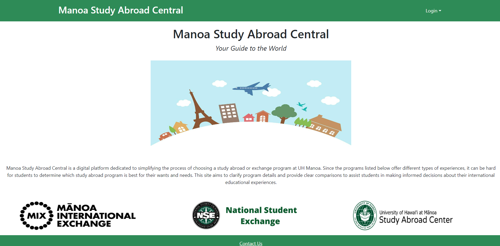
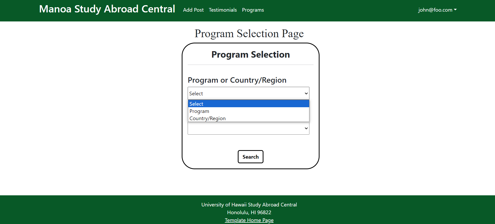
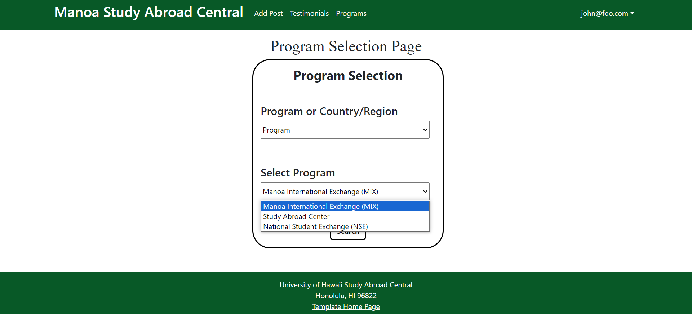
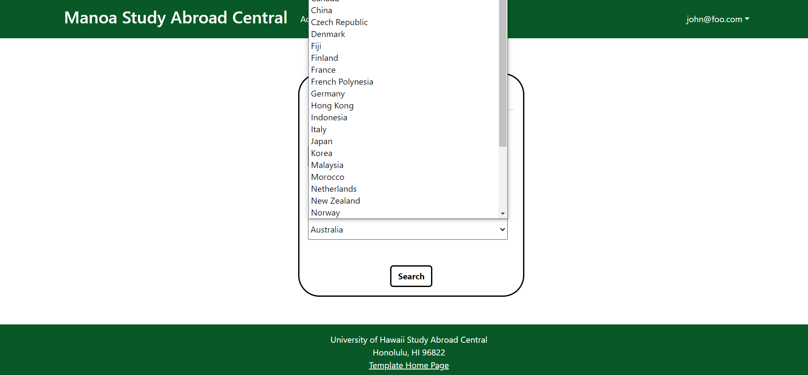
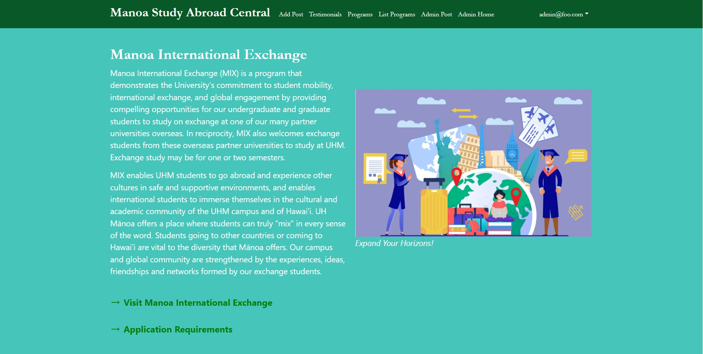
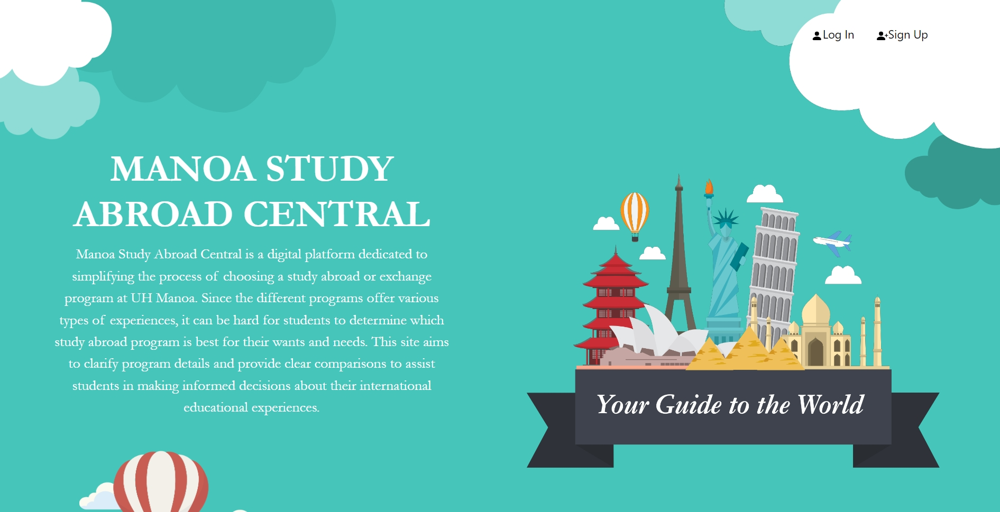
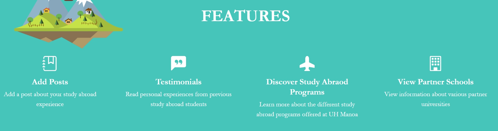
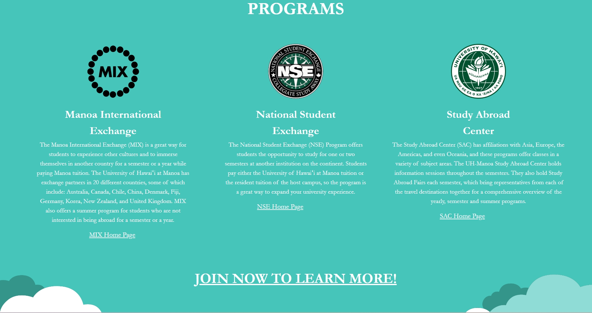
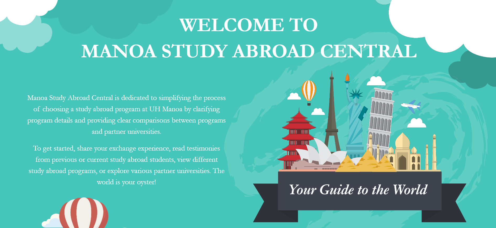
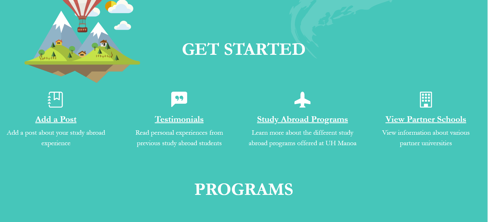

  <li><strong>Role: </strong>UX/UI Designer, Full-Stack Developer (Team of 5)</li>
  <li><strong>Duration: </strong>1 semester/16 weeks</li>
  <li><strong>Tools: </strong>GitHub, React, Bootstrap </li>
  <li><strong>Responsibilities: </strong>Created initial program search page, MIX information page, and redesigned website layout. </li>
 

## Overview

Manoa Study Abroad Central is a web-based application that helps UH Manoa students discover more information about different study abroad programs at our university, developed with a few classmates from ICS 314, a software engineering course at UH Manoa. Since the three different study abroad programs offer various types of experiences and partner with numerous schools and regions, Manoa Study Abroad Central helps students figure out which program is best for them. Our platform includes several features such as adding a post about one’s study abroad experience, reading reviews from previous or current study abroad students, information about the three different study abroad programs, and numerous universities partnered with UH. This was my first, full-scale UX/UI and Software Engineering project. 

<strong>Goal:</strong> Build a centralized platform for UH students to explore study abroad programs.

<strong>My Role:</strong> Designed program selection page, MIX information page, key UI page designs, and implemented frontend components using React and Bootstrap.

## Initial Setup

I initially created the initial landing page, the first page viewed when visiting the website. Users are greeted by the app's name, slogan, mission statement, and study abroad programs. 

 

## Program Selection Page Feature Development

I improved the program selection page by creating detailed selection options. On the program selection page, users can search for information about a country or study abroad program. Based on the user's selection from the first dropdown menu, the second dropdown menu dynamically changes and shows different options. Pressing "Search" takes the user to the respective program or country's information page. 

On the other hand, if the user selects “Country/Region”, the second drop-down menu would instead populate with different countries or regions available to study abroad students from UH Manoa. 

 

### MIX Page
The Manoa International Exchange (MIX) informational page gives a brief overview of the program followed by a link to the MIX homepage and a list of application requirements at the bottom of the page. 

## UI Refinement and Final Design

For the final week, I redesigned the app's UI look. Although I mainly focused on the look of the Landing and Home pages, every other page on the website followed the same layout and design/color scheme. By researching examples of different travel websites, I used a CSS stylesheet and travel-themed components to create the website's visual look. 

### Updated Landing Page 

### New Home Page

# Learning Impact

Although I sort of knew how to use BootStrap React beforehand, this project has exponentially helped me learn more about the different features of BootStrap React, giving me hands-on experience. Though I struggled through it, I learned how to create complex web pages. This project has also shown me what it takes to create a well-functioning application and what goes on behind the scenes of websites I use daily. 

Throughout the project, I mostly worked on front-end development and web design, which I enjoyed. As I was sort of interested in web design and front-end development beforehand, this project has furthered my interest in these two areas. In the near future, I hope to do something similar in my future career or internships. 

Additionally, I enjoyed working on this website since I’m interested in studying abroad. When researching the different programs and countries I could visit, I wish I had a resource like this where the miscellaneous study abroad information was packed into one place. It would’ve also been nice if I could read about different students’ study abroad experiences instead of asking around and learning by word of mouth. 

Visit [Manoa Study Abroad Central Github Organization](https://github.com/manoa-study-abroad-central). 
